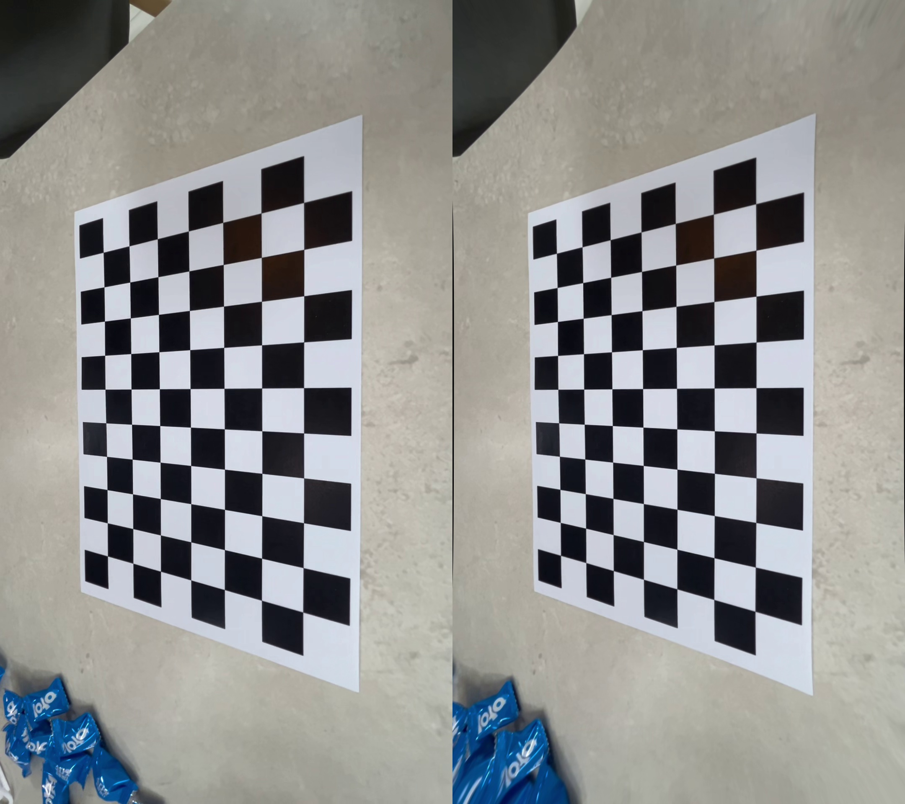

# CameraCalibration

## 📌 프로젝트 개요

이 프로젝트는 **카메라의 내부 파라미터를 추정**하고, 이를 바탕으로 **렌즈 왜곡을 보정**하는 과정을 다룹니다.  
OpenCV를 이용해 **체커보드 기반의 카메라 캘리브레이션**을 수행하고,  
실제 영상에 보정 결과를 적용하여 **왜곡된 이미지와 보정 이미지의 비교**를 제공합니다.

### ✅ 개발 환경

- Python 3.10+
- OpenCV 4.x
- NumPy

### 🔗 리소스 출처

- 체커보드: [Calibration Checkerboard Collection](https://markhedleyjones.com/projects/calibration-checkerboard-collection)

---

## 📈 결과 분석

카메라 캘리브레이션을 통해 내부 파라미터(카메라 매트릭스)와 렌즈 왜곡 계수를 추정하고,  
이를 바탕으로 영상의 왜곡을 효과적으로 보정할 수 있었다.

체커보드를 다양한 각도에서 촬영한 영상에서 총 64장의 유효 프레임을 추출하였으며,  
평균 재투영 오차(RMSE)는 0.4984로 수렴하였다.
이는 실내 광각 촬영 환경에서 발생할 수 있는 왜곡을 감안할 때,  
보정 효과를 적용하기에 충분히 허용 가능한 수준의 오차로 판단된다.

### 🔧 카메라 캘리브레이션 결과

- **Focal Length (fx, fy)**: 893.7861, 895.2723  
- **Principal Point (cx, cy)**: 534.6597, 957.1658  
- **Distortion Coefficients (k1, k2, p1, p2, k3)**:  
  `[0.0266, -0.0151, -0.0009, -0.0004, -0.0475]`  
- **Reprojection RMSE**: 0.4984

### 🔍 보정 전/후 비교

보정 전에는 광각 렌즈 특유의 곡률 왜곡으로 인해 체커보드 외곽이 휘어져 보였으나,  
보정 후에는 격자선이 곧게 펴지고, 각 칸의 비율도 보다 균일하게 보였다.  
또한 전체 영상에 대해서도 프레임 단위로 보정을 적용하여  `.mp4` 형태로 저장한 결과,  
실시간 보정 시스템의 기초 실험으로 활용할 수 있을 만큼 자연스러운 결과가 나왔다.

---

## 🔧 개선사항

- 현재는 기본적인 `cv2.undistort()` 함수를 사용했으나,  
  추후 `cv2.initUndistortRectifyMap()` + `cv2.remap()` 을 사용하면 성능 및 품질 개선 가능
- 체커보드 대신 Charuco board 등을 사용하면 **더 높은 정확도** 확보 가능
- 영상 전체에 대해 **실시간 왜곡 보정 데모** 구성도 가능 (OpenCV + GUI)
